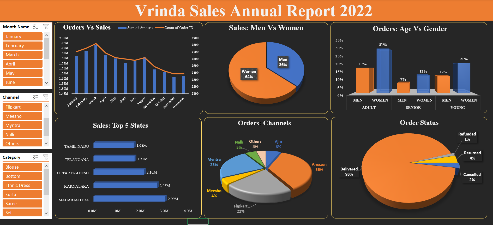

# Vrinda Store Sales Analysis — Excel

## 📊 Project Overview

This project analyzes Vrinda Store's 2022 sales data using Microsoft Excel.

The analysis focuses on monthly sales performance, customer demographics, geographic sales distribution, sales channels, product categories, and order status.

An interactive Excel dashboard was developed to present the analysis through KPIs, PivotTables, charts, and slicers.

---

## 🎯 Business Objectives

- Analyze monthly sales and order trends
- Compare sales performance across customer genders
- Understand purchasing patterns across age groups
- Identify the top-performing states
- Analyze sales contribution by e-commerce channel
- Examine order fulfillment status
- Analyze product category performance
- Provide an interactive dashboard for business reporting

---

## 🗂️ Dataset

The dataset contains 2022 e-commerce order information with fields including:

- Order ID
- Customer ID
- Gender
- Age
- Date
- Order Status
- Sales Channel
- SKU
- Category
- Size
- Quantity
- Amount
- Ship City

---

## 🛠️ Tools & Excel Skills

**Tool:**
- Microsoft Excel

**Skills demonstrated:**
- Data organization
- PivotTables
- Pivot-based analysis
- Slicers
- KPI reporting
- Sales trend analysis
- Customer segmentation
- Geographic analysis
- Channel analysis
- Order-status analysis
- Data visualization
- Dashboard design

---

## 📈 Key Metrics

The dashboard analyzes:

- Monthly sales
- Monthly order volume
- Sales by gender
- Orders by age group and gender
- Top 5 states by sales
- Sales by channel
- Order-status distribution
- Category performance

---

## 📊 Dashboard Analysis

### Monthly Performance

The dashboard compares monthly sales with order volume to identify changes in sales activity throughout 2022.

### Customer Demographics

Customer analysis is segmented by:

- Gender
- Age group
- Gender within age groups

### Geographic Performance

The dashboard identifies the top-performing states based on sales.

### Sales Channels

Sales are analyzed across channels including:

- Amazon
- Flipkart
- Myntra
- Ajio
- Meesho
- Nalli
- Others

### Order Status

Orders are categorized into:

- Delivered
- Returned
- Cancelled
- Refunded

---

## 🖼️ Dashboard Preview



---

## 📁 Project Structure

```text
vrinda-store-sales-analysis-excel/
│
├── README.md
│
├── Vrinda_Store_Sales_Analysis_2022.xlsx
│
└── vrinda-sales-dashboard.png
